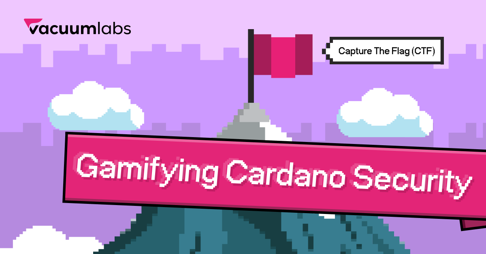

# Cardano Vulnerabilities Game — Capture the Flag (CTF)

Welcome to the Cardano Capture the Flag (CTF) challenge by the
[Vacuumlabs Auditing](https://vacuumlabs.com/blockchain/smart-contract-auditing/)
team!

It is a game where Cardano developers and enthusiasts can try to exploit
purposely vulnerable smart contracts and learn about the most common security
issues and how to prevent them. In a way, you can try the job of auditors on
some common Cardano vulnerabilities.

We believe this will provide the community with educational materials needed to
write more secure smart contracts.



## How it works

Each task has its own folder. It consists of three main parts:

- The validators written in [Aiken](https://aiken-lang.org/). They are located
  in the `validators` folder. You can compile them by running `aiken build` in
  the root directory of the task.
- The off-chain code. We use the [Lucid](https://github.com/spacebudz/lucid)
  library and the [Blockfrost](https://blockfrost.io/) API to interact with the
  Preview testnet. The off-chain scripts contain:
  - Code deploying the smart contracts onto the Cardano Preview testnet.
  - Sample interaction with the deployed contract. This is the part you should
    modify and / or extend to exploit a vulnerability.
  - Tests that verify if you successfully exploited the vulnerability or not.
- A README file containing task-specific instructions. The first sample
  [hello_world](./00_hello_world/README.md#how-to-solve-the-challenges) task
  contains a bit more info on how exactly to play.

The tasks are more or less of an increasing difficulty. The suggested path is to
go from a simple [hello_world](./00_hello_world/) task up. The tasks' README's
also explain more in the beginning, leaving more up to you in the more complex
levels.

## Setup

To be able to run the first task, just 3 steps of setup are needed:

1. Install
   [Deno](https://docs.deno.com/runtime/manual/getting_started/installation).
2. Install [Aiken](https://aiken-lang.org/installation-instructions).
3. Copy the template config file in `common/offchain/config_temp.ts` to
   `common/offchain/config.ts`.

That's it and you can now play in the local Lucid emulator! The emulator is
great for testing smart contracts fast.

You can now try the first [hello_world](./00_hello_world/) task (read its README
carefully) and get to the _yellow_ test results.

## Finishing the setup

To get to the _green_ test results and really finish the task, it is required to
finish it in the testnet environment. To set this up, there are a few more steps
you need to take:

1. Generate a private key and address. We prepared a private key generation code
   for you, you can run it by:

   ```
   deno run --allow-net --allow-write ./common/offchain/generate_private_key.ts
   ```

   Put your private key into the `PRIVATE_KEY` constant located in the
   `common/offchain/config.ts`.

   DO NOT REUSE A PRIVATE KEY THAT YOU USE FOR MAINNET! Generate a new one
   instead!
2. Get Blockfrost API key by registering at https://blockfrost.io/ . Put this
   API key into the `BLOCKFROST_API_KEY` constant in the
   `common/offchain/config.ts`.
3. You need some starting ADA in your wallet so you can interact with the
   Cardano testnet. Request tADA into your address (see the newly created
   `key.addr` file) from the
   [Cardano Faucet](https://docs.cardano.org/cardano-testnet/tools/faucet/). The
   environment we use is **Preview Testnet**.
4. You are good to go! To verify that everything is set up correctly, try
   solving the very first sample task: [Hello World](./00_hello_world/). You
   should see green test results when everything is done correctly.

## Tasks

0. [hello_world](./00_hello_world/) — A sanity check to verify that everything's
   setup correctly.
1. [sell_nft](./01_sell_nft/) — Try to buy two NFTs by paying less than their
   stated prices!
2. [vesting](./02_vesting/) — Try to skip the vesting period.
3. [multisig_treasury](./03_multisig_treasury/) — Unlock treasury without all
   the signatures.
4. [tipjar](./04_tipjar/) — Try to prevent others from tipping into a Tip Jar.
5. [purchase_offer](./05_purchase_offer/) — Sell an NFT while collecting more
   money than offerred.
6. [tipjar_v2](./06_tipjar_v2/) — The Tip Jar was patched. Try to prevent others
   from tipping into the upgraded Tip Jar.
7. [multisig_treasury_v2](./07_multisig_treasury_v2/) — The treasury was
   upgraded. Try to unlock it without all the signatures again.

## Troubleshooting

### Videos

There are videos in the [videos folder](./videos/). Check them out if you're
struggling with making the framework work. Beware, it can contain spoilers,
especially the first video that solves the _hello_world_ task entirely. The
later videos do not explain the solutions. They are here mostly to demonstrate
Catalyst milestones' completion. You should strive to find the solutions
yourself.

### Errors during a transaction submission

Sometimes, Lucid errors out when it submits a transaction. This usually happens
on the real testnet when you wait for too short between two different
transactions from your wallet.

In the meantime, if you encounter this error, you can try to change the default
value of `CONFIRMS_WAIT` in the [config](./common/offchain/config.ts) to a
higher number. This makes it wait for more confirmations before it follows up
with the next transaction, increasing the time and making the chance of such
errors smaller.

### Long waiting time on the testnet

From our experience, the time required for a transaction validation are ever
changing on the preview testnet. If it takes too long, try to decrease the
default value of `CONFIRMS_WAIT` in the [config](./common/offchain/config.ts) to
a lower number. Be careful not to change it too low, otherwise you might get
errors during submissions.

This is why we run the transactions on the Lucid emulator first. Only if they
pass there we try to replicate it on the testnet as well.

## Feedback

[Join our Discord](https://discord.gg/5XVW2MUdWu). You can ask questions, share
your solutions and discuss anything (not only) security related. Alternatively,
you can share your thoughts and feedback with us at audit@vacuumlabs.com as
well.

## Warning & Disclaimer

The smart contract code in the examples is purposely vulnerable. DO NOT copy
parts of the code into your project, as you may copy a vulnerability, too.
Beware that the code may contain more than a single vulnerability.

## Changelog

This project is ever evolving. Please refer to the [Changelog](./CHANGELOG.md)
to see the changes over time.

## License

Licensed under GPL-3.0. Full license text can be found [here](./LICENSE).
